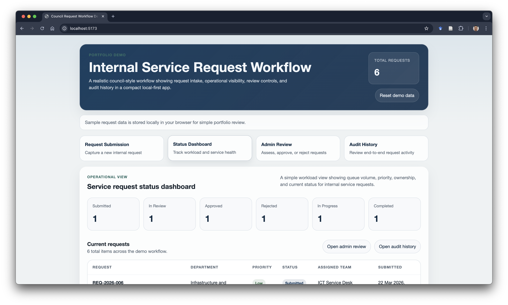
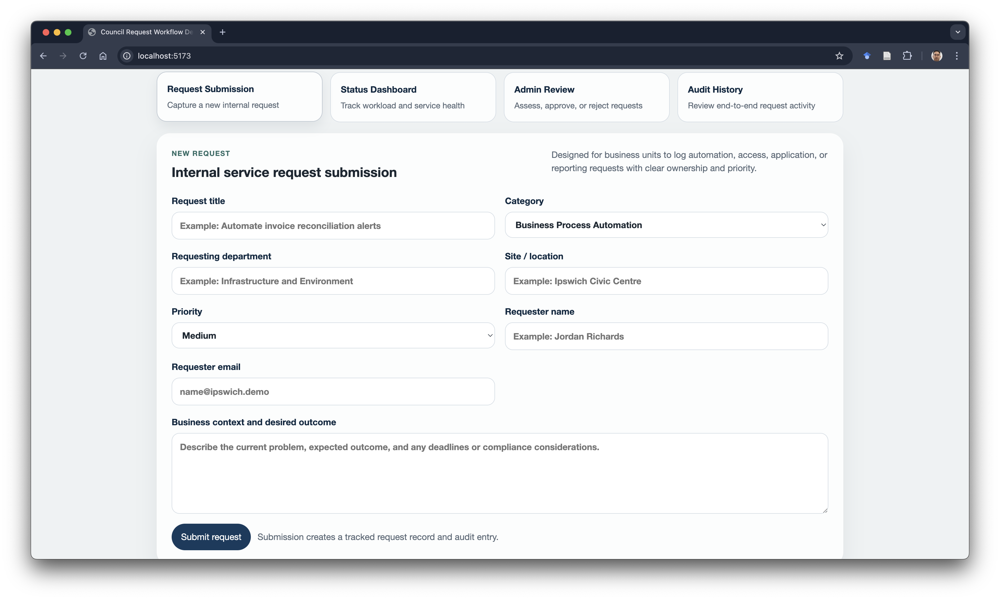
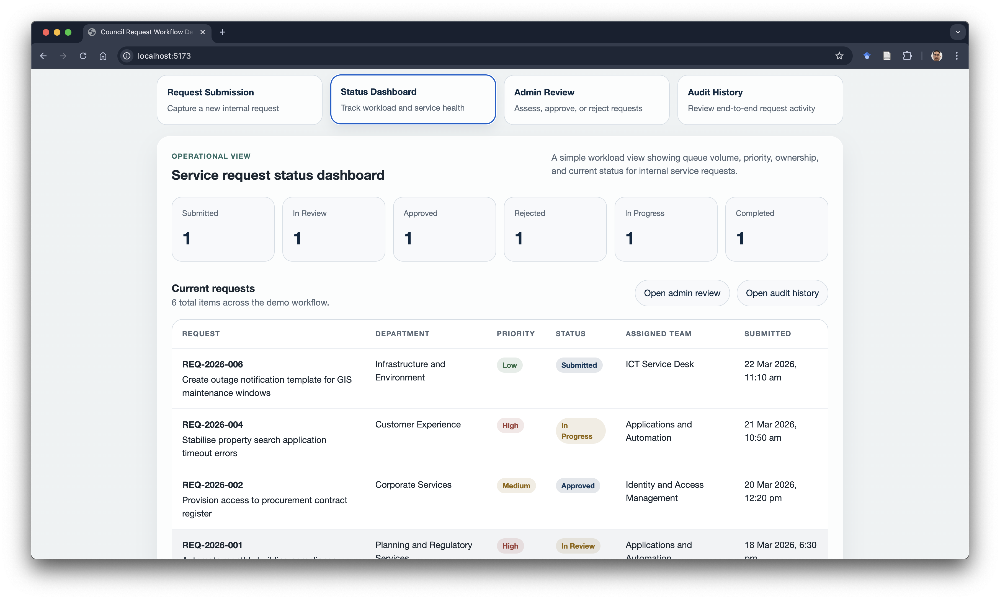
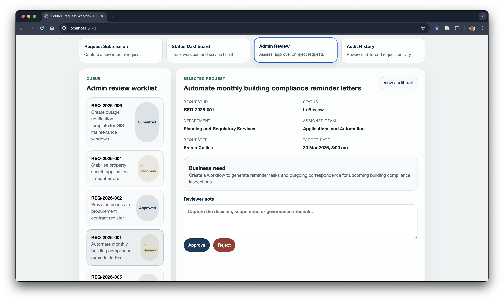
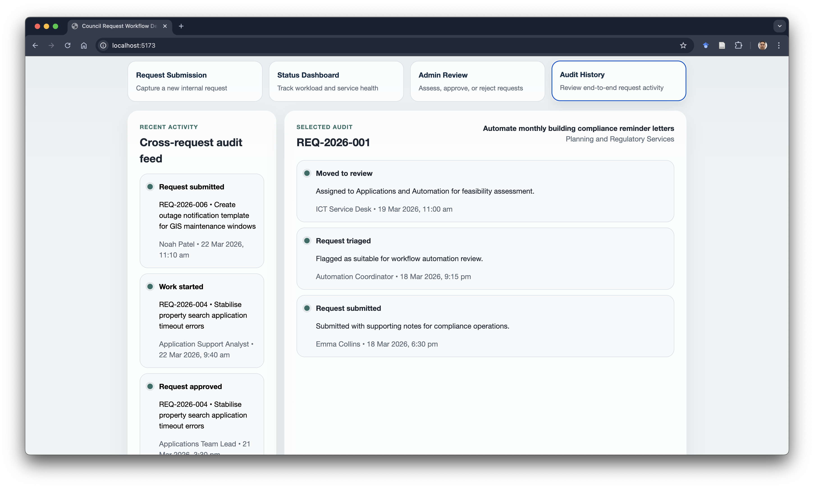
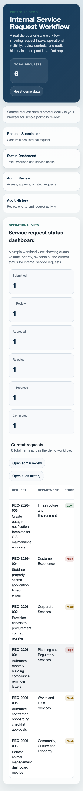

# Council Request Workflow Demo

A React and TypeScript service-request demo: submit, triage, approve, progress and review an audit timeline. It uses synthetic records and browser storage, so reviewers can run it without a backend or credentials.

[Case study](docs/case-study.md) · [Test and support guide](docs/quality-and-support.md) · [Regression tests](tests/workflow.test.cjs)

[](https://github.com/salman-chowdhury/council-request-workflow-demo/actions/workflows/ci.yml)

**Scope:** this is a local UI/workflow prototype. The admin view is a simulated persona, not authenticated authorisation; the editable local history is not a tamper-proof audit log.

## What This Project Demonstrates

This demo focuses on a common internal business problem: business units need a structured way to request automation, application support, reporting changes, access, or service desk assistance, while the delivery team needs visibility, governance, and auditability.

The app intentionally stays small, but it still shows:

- clear domain modelling with TypeScript
- realistic workflow states and admin actions
- business-facing UI for request intake and operational review
- lightweight persistence and validation for a reliable demo experience
- documentation written for both technical reviewers and non-technical hiring managers

## Features And Business Value

| Feature | Business value |
| --- | --- |
| Standardised request submission form | Reduces back-and-forth by capturing the key details needed for triage and delivery. |
| Status dashboard | Gives teams quick operational visibility across workload, priority, ownership, and lifecycle state. |
| Admin review workflow | Demonstrates approval controls, triage decisions, and structured progression through work states. |
| Audit history view | Supports traceability, accountability, and lightweight governance for internal requests. |
| Sample request records | Makes the demo credible immediately and helps reviewers understand likely business use cases. |
| Validation and storage recovery | Prevents bad input and keeps the demo usable even if browser data becomes invalid. |

## Why This Is Relevant For Automation / Application Roles

Automation and application support roles are usually less about isolated coding exercises and more about translating business needs into manageable workflows, operational controls, and maintainable systems. This project shows that mindset by combining request intake, review logic, status tracking, data validation, and audit history in a format that feels like an internal business tool rather than a generic front-end sample.

## Stack

- React 18
- TypeScript
- Vite
- CSS
- Local JSON sample records plus `localStorage` persistence

## Quick Start

### Prerequisites

- Node.js 22+
- npm 9+

### Run Locally

```bash
npm ci
npm run dev
```

Open the local Vite URL shown in the terminal, usually `http://localhost:5173`.

### Verification

```bash
npm test
npm run check
npm run build
```

## Demo Walkthrough

1. Open `Request Submission` and submit a new automation or support request.
2. Review queue totals and request details in `Status Dashboard`.
3. Move to `Admin Review` to progress, approve, reject, or complete a request.
4. Open `Audit History` to inspect the request timeline and recent cross-request activity.
5. Use `Reset demo data` to restore the built-in sample request records.

## Screenshots

### App Overview


### Request Submission


### Status Dashboard


### Admin Review


### Audit History


### Mobile Dashboard


## Sample Request Records

Built-in records cover multiple realistic scenarios, including:

- business process automation for compliance reminders
- access provisioning with approval checks
- reporting enhancement delivery
- application support incident remediation
- rejected automation work due to missing governance detail
- new service desk communication request awaiting triage

See [docs/sample-request-records.md](./docs/sample-request-records.md) for a quick reviewer-friendly summary.

## Repository Structure

```text
.
├── architecture.md
├── docs/
│   ├── resume-bullets.md
│   └── sample-request-records.md
├── screenshots/
│   └── README.md
├── src/
│   ├── components/
│   ├── data/
│   │   ├── requestOptions.ts
│   │   ├── requestValidation.ts
│   │   ├── sample-request-records.json
│   │   └── workflow.ts
│   ├── styles/
│   ├── App.tsx
│   ├── main.tsx
│   └── types.ts
├── index.html
├── package.json
└── vite.config.ts
```

## Documentation

- Architecture overview: [architecture.md](./architecture.md)
- Sample records: [docs/sample-request-records.md](./docs/sample-request-records.md)
- Resume-ready bullets: [docs/resume-bullets.md](./docs/resume-bullets.md)
- Screenshot guidance: [screenshots/README.md](./screenshots/README.md)

## Practical Design Choices

- No backend by design: the project is easy to review, clone, and run during an interview.
- Local-first persistence: enough realism for a demo without introducing deployment overhead.
- Minimal validation and error states: practical quality improvements without overengineering the app.
- Small, named data utilities: keeps request options, validation, and workflow logic easier to review.

## Suggested Resume Framing

One concise framing option:

> Built a TypeScript-based internal service request workflow demo that models request intake, approval, status tracking, validation, and audit history for a council-style operating environment using a lightweight local-first architecture.

## Natural Next Steps

- Add search, filtering, and SLA indicators for queue management
- Introduce role-specific views for requester, analyst, and approver personas
- Replace `localStorage` with a small API or SQLite-backed persistence layer
- Add browser end-to-end tests alongside the existing domain regression tests
