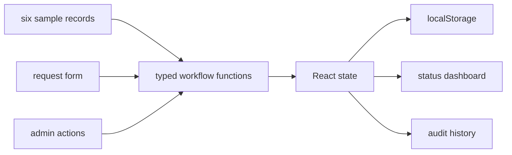

# Council Workflow Case Study

## Problem and solution

Internal service teams need consistent request intake, visible ownership, controlled transitions, and an audit trail. This self-contained React application models that workflow with typed records and browser-local persistence so reviewers can exercise it without infrastructure.

## Architecture



## Trade-offs

- Local storage makes the demo immediate but provides no shared state, authorization, or server audit guarantees.
- Explicit workflow functions are easy to inspect but currently lack automated transition tests.
- Sample data demonstrates every status but does not measure a real service queue.

## Measured validation

- `npm run check` passed TypeScript validation.
- Production build completed with 40 transformed modules and a 170.07 kB JavaScript bundle (53.08 kB gzip).
- Six sample requests cover submitted, review, approved, rejected, in-progress, and completed states.
- Playwright captured desktop dashboard/admin/audit states and a 390 x 844 mobile dashboard.

## Limitations and failure modes

- Browser storage can be cleared and is not a system of record.
- No authentication, concurrency control, notifications, search, or SLA calculation.
- `npm audit` reported 4 dependency vulnerabilities (1 low, 2 moderate, 1 high).

## Reproduce

```bash
npm ci
npm run check
npm run build
npm run dev
```

## Regression coverage — 5 September 2026

Eight domain tests now cover validation, audit preservation, invalid transitions, request IDs and blocked/corrupt browser storage. Tests, typecheck and build passed locally. See [quality and support](quality-and-support.md) for defect reproduction and acceptance scenarios.
